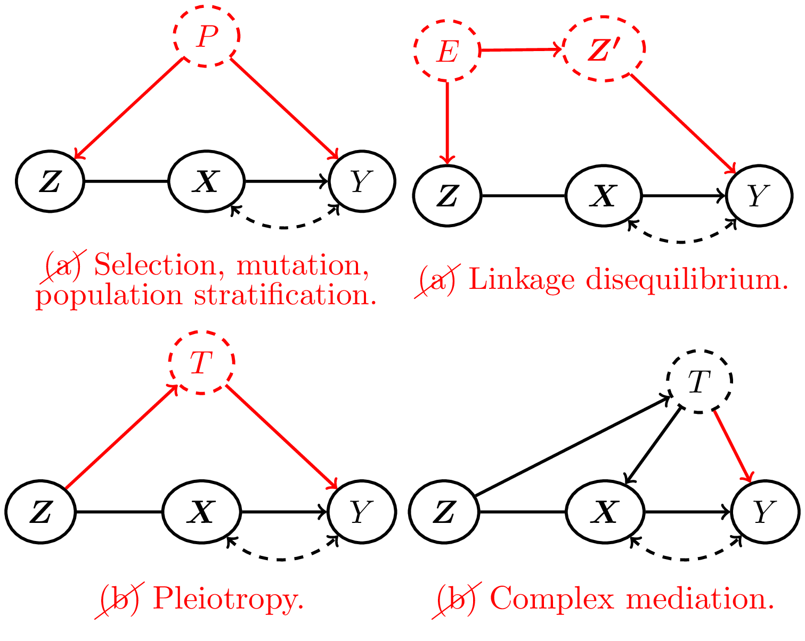

# BudgetIV: partial identification of causal effects with mostly invalid isntruments
<p align="center">

</p>

# Introduction
`BudgetIV` provides a tuneable and interpretable method for relaxing the instrumental variables (IV) assumptions to infer treatment effects in the presence of unobserved confounding. For a pre-treatment covariate to be a valid IV, it must be (a) unconfounded with the outcome and (b) have a causal effect on the outcome that is exclusively mediated by the exposure. It is impossible to test the validity of these IV assumptions for any particular pre-treatment covariate; however, when different pre-treatment covariates give differing causal effect estimates if treated as IVs, then we know at least one of the covariates violates these assumptions. `BudgetIV` exploits this fact by taking as input a minimum ''budget'' of pre-treatment covariates assumed to be valid IVs. This can be extended to assuming a set of budgets for varying ''degrees'' of validity set by the user and defined formally through a parameter that captures violation of either IV assumption. These budget constraints can be chosen using specialist knowledge or varied in a principled sensitivity analysis. `BudgetIV` supports non-linear treatment effects and multi-dimensional treatments; requires only summary statistics rather than raw data; and can be used to construct confidence sets under a standard assumption from the Mendelian randomisation literature. With one-dimensional $\Phi (X)$, a computationally-efficient variant `Budget_IV_Scalar` allows for use with thousands of pre-treatment covariates. 

We assume a heterogenous treatment effect, implying the following structural causal model: $$Z := f_z (\epsilon_z),$$ $$X := f_x (Z, \epsilon_x),$$ $$Y = \theta \Phi (X) + g_y (Z, \epsilon_y).$$ There may be association between $\epsilon_y$ and $\epsilon_z$, indicating a violation of the unconfoundedness assumption (a); and $g_y$ may depend on $Z$, indicating violation of exclusivity (b). With `BudgetIV`, the user defines degrees of validity $0 \leq \tau_1 \leq \tau_2 \leq \ldots \leq \tau_K$ that may apply to any candidate instrument $Z_i$. If $Z_i$ satisfies the $j$'th degree of validity, this means $\lvert \mathrm{Cov} (g_y (Z, \epsilon_y), Z_i) \rvert \leq \tau_j$. Choosing $\tau_1 = 0$ would demand some pre-treatment covariates give valid causal effect estimates, while choosing $\tau_K = \infty$ would allow for some covariates to give arbitrarily biased causal effect estimates if treated as IVs. `BudgetIV` will return the corresponding identified/confidence set over causal effects that agree with the budget constraints and with the user-input summary statistics: `beta_y` corresponding to $\mathrm{Cov} (Y, Z)$ and `beta_Phi` corresponding to $\mathrm{Cov} (\Phi (X), Z)$. Other regression coefficients such as odds ratios, hazard ratios or multicolinearity-adjusted regression coefficients may be used for `beta_y` and `beta_Phi`, but this also changes the interpretation of the $\tau$'s. 

For further methodological details and theoretical results and advanced use cases, please refer to Penn et al. (2024) <doi:10.48550/arXiv.2411.06913>.

# Installation
To install the development version from GitHub, using `devtools`, run:
``` r
devtools::install_github('jpenn2023/budgetivr')
```

# Examples
First, we generate a dataset and calculate the corresponding summary statistics:
``` r
data(simulated_data_BudgetIV)

beta_y <- simulated_data_BudgetIV$beta_y

beta_phi_1 <- simulated_data_BudgetIV$beta_phi_1
beta_phi_2 <- simulated_data_BudgetIV$beta_phi_2

beta_phi <- matrix(c(beta_phi_1, beta_phi_2), nrow = 2, byrow = TRUE)

delta_beta_y <- simulated_data_BudgetIV$delta_beta_y

tau_vec = c(0)
b_vec = c(3)

x_vals <- seq(from = 0, to = 1, length.out = 500)

ATE_search_domain <- expand.grid("x" = x_vals)

phi_basis <- expression(x, x^2)

X_baseline <- list("x" = c(0))

partial_identification_ATE <- BudgetIV(beta_y = beta_y,
                                       beta_phi = beta_phi,
                                       phi_basis = phi_basis,
                                       tau_vec = tau_vec,
                                       b_vec = b_vec,
                                       ATE_search_domain = ATE_search_domain,
                                       X_baseline = X_baseline)
```

Now we run `BudgetIV` to partially identify the budget assignments and corresponding average causal effect bounds. We use a non-zero value $\tau_1 = ...$ for visualisation of the bounds: 
``` r
BudgetIV(... THINGS...)
``` 
To include error in `beta_y`, we can set `delta_beta_y \neq 0`
``` r
delta_beta_y = ... 

BudgetIV(... THINGS...)
``` 